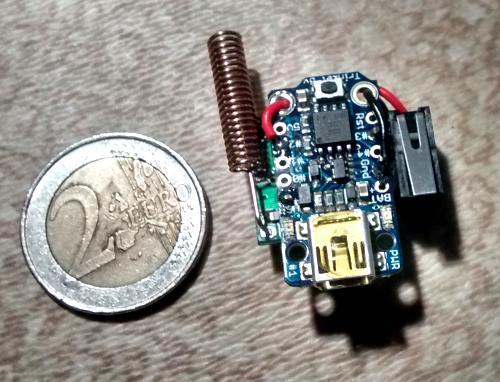
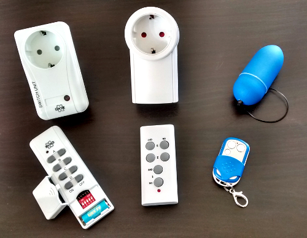
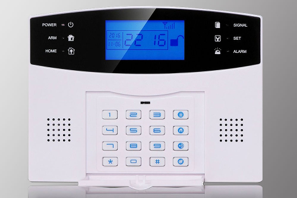

433MHz OOK Remote
=================

Control some devices such as wireless sockets or sex toys
with a small, easy to build remote.

The System
----------

This is what the remote looks like.  

You can turn on or off any of these devices, regardless of
their configuration.  
  

Requirements
------------

* Some Arduino compatible device.
  This project was created using [Adafruit's Trinket](https://www.adafruit.com/products/1501).
* An 433MHz transmitter.
  This project was created using a [simple transmitter board](http://www.amazon.com/dp/B008A4UWK6/).
* An antenna suitable for the 433MHz band.
* Some wires, pin headers, a switch, etc.

Usage
-----

Just configure the pin numbers to match your setup and flash the code on your Arduino
compatible device. As you keep pushing the button, you can see the LED blinking.

* 1 blinks = Turn on wireless sockets of type A (left in the picture).
* 2 blinks = Turn off wireless sockets of type A.
* 3 blinks = Turn on wireless sockets of type B (middle in the picture).
* 4 blinks = Turn off wireless sockets of type B.
* 5 blinks = Arm MKT M2B GSM alarm systems (takes up to 30min).
* 6 blinks = Disarm MKT M2B GSM alarm systems (takes up to 30min).
* 7 blink  = Turn on wireless massage eggs.
* 8 blinks = Turn off wireless massage eggs.
Example: To turn off all wireless sockets (type A), just press and hold the button
until the LED flashed 4 times. Then release it. The remote will send "turn-off-packets"
for all possible configurations of the sockets. While it is sending packets,
the LED will stay on.
